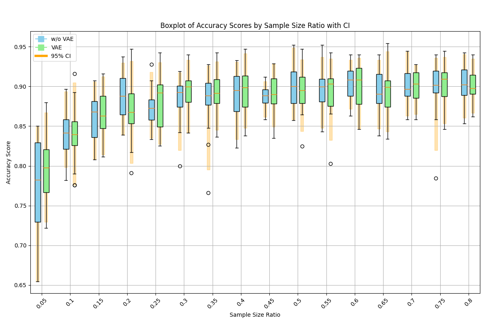
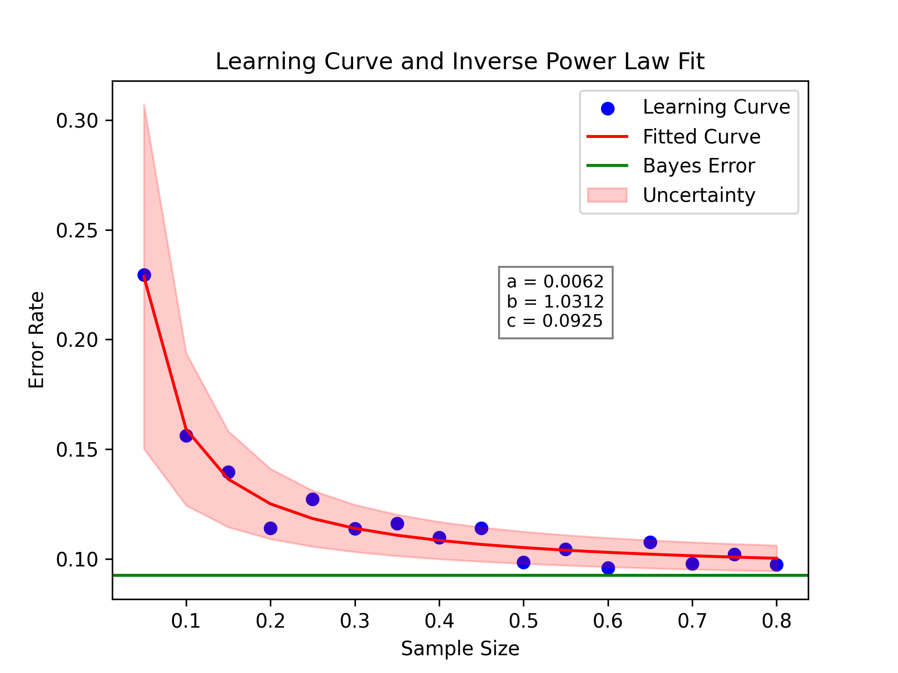
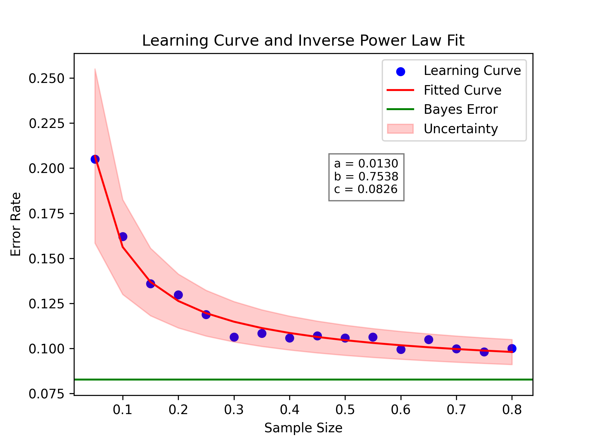

# VAE Reconstruction Under Sample Scarcity


This repository studies whether variational autoencoder (VAE) reconstruction can improve downstream biomedical image classification under limited training data.

The project focuses on X-ray image classification under sample scarcity. It compares classifiers trained on original images with classifiers trained on VAE-reconstructed images across different training sample-size ratios.

This repository is intended for research, education, and portfolio demonstration. It is not intended for clinical diagnosis or medical deployment.

---

## Project Idea

Biomedical imaging datasets are often limited, imbalanced, or difficult to label. In low-data regimes, classifiers may overfit or become unstable.

This project investigates the following question:

> Can VAE-reconstructed X-ray images improve downstream classification stability or sample efficiency when labeled training data are scarce?

The current implementation supports:

- synthetic downstream smoke experiments
- synthetic VAE reconstruction smoke experiments
- original-image X-ray downstream baseline
- reconstruction-based X-ray downstream pipeline
- original vs VAE comparison
- bootstrap sample-size sweeps
- balanced accuracy evaluation
- reconstruction quality metrics
- legacy result documentation

---

## Current Status

Implemented:

- Reusable image loading from zip files
- Reproducible train/validation/test splitting
- Reconstruction metrics: MSE, MAE, SSIM, PSNR
- Downstream classification metrics
- Random Forest and SVM classifier builders
- Bootstrap sample-size sweep
- Skip-connected VAE reconstruction model
- Plain VAE reconstruction model
- Denoising autoencoder reconstruction model
- Generic reconstruction model builder
- Synthetic downstream smoke test
- Synthetic reconstruction smoke test
- Real X-ray original-image baseline script
- Real X-ray reconstruction-based downstream pipeline
- Four-method reconstruction comparison script
- GitHub Actions CI
- Legacy code and preliminary legacy figures

Future extensions:

- CNN classifier baseline
- More random seeds
- More VAE training epochs
- More extensive statistical analysis
- Calibration and error analysis

---

## Repository Structure

```text
vae-reconstruction-scarcity/
├── configs/
│   ├── downstream_smoke.yaml
│   ├── downstream_xray_original.yaml
│   ├── downstream_xray_skip_vae.yaml
│   ├── downstream_xray_plain_vae.yaml
│   ├── downstream_xray_denoising_ae.yaml
│   └── reconstruction_smoke.yaml
├── legacy/
│   └── old_xray_vae/
├── results/
│   ├── figures/
│   │   └── legacy/
│   └── metrics/
├── scripts/
│   ├── compare_original_vs_reconstruction.py
│   ├── compare_reconstruction_methods.py
│   ├── make_smoke_downstream_figure.py
│   ├── plot_sample_size_curve.py
│   ├── run_downstream_xray_original.py
│   ├── run_downstream_xray_reconstruction.py
│   ├── run_smoke_downstream.py
│   └── run_smoke_reconstruction.py
├── src/
│   └── vae_scarcity/
│       ├── data/
│       │   ├── loaders.py
│       │   └── splits.py
│       ├── evaluation/
│       │   ├── downstream.py
│       │   ├── reconstruction.py
│       │   └── sample_size.py
│       ├── models/
│       │   ├── classifiers.py
│       │   └── vae.py
│       ├── training/
│       │   └── reconstruction_training.py
│       └── plotting.py
├── tests/
├── README.md
├── LICENSE
├── pyproject.toml
└── requirements.txt
```

---

## Installation

Clone the repository:

```bash
git clone https://github.com/rhouhou/vae-reconstruction-scarcity.git
cd vae-reconstruction-scarcity
```

Create and activate a virtual environment:

```bash
python3 -m venv .venv
source .venv/bin/activate
```

Install the package and development dependencies:

```bash
python -m pip install --upgrade pip
python -m pip install -r requirements.txt
python -m pip install -e ".[dev]"
```

For VAE training and reconstruction scripts, install the optional deep learning dependency:

```bash
python -m pip install -e ".[deep-learning]"
```

Run tests:

```bash
python -m pytest -q
```

---

## Dataset

The real X-ray experiments expect a local zip file containing class folders.

The dataset is not included in this repository.

Expected folder structure inside the zip:

```text
COVID/
NORMAL/
PNEUMONIA/
```

or, if the images are inside a root folder:

```text
some_root_folder/
├── COVID/
├── NORMAL/
└── PNEUMONIA/
```

The class names and optional root folder are configured in:

```text
configs/downstream_xray_original.yaml
configs/downstream_xray_skip_vae.yaml
```

Example configuration:

```yaml
data:
  image_size: [64, 64]
  classes:
    - COVID
    - NORMAL
    - PNEUMONIA
  root_dir: null
  test_size: 0.20
  val_size: 0.10
  normalize: true
  color_mode: rgb
```

If your zip contains a root directory, change `root_dir`.

Example:

```yaml
root_dir: COVID19_Pneumonia_Normal_Chest_Xray_PA_Dataset
```

Datasets, model checkpoints, and generated experiment outputs are ignored by Git and should not be committed.

---

## Documentation

Additional documentation is available in:

- [Dataset notes](docs/dataset.md)
- [Experiment workflows](docs/experiments.md)
- [Final experiment protocol](docs/final_protocol.md)

---

## Reproducible Workflows

### 1. Synthetic downstream smoke test

This test does not require real data. It creates a small synthetic two-class image dataset and runs a Random Forest sample-size sweep.

```bash
python scripts/run_smoke_downstream.py \
  --config configs/downstream_smoke.yaml \
  --output-dir results/smoke_downstream
```

Generate a figure:

```bash
python scripts/make_smoke_downstream_figure.py \
  --summary-csv results/smoke_downstream/downstream_smoke_summary.csv \
  --output-path results/smoke_downstream/downstream_smoke_curve.png
```

Expected outputs:

```text
results/smoke_downstream/downstream_smoke_results.csv
results/smoke_downstream/downstream_smoke_summary.csv
results/smoke_downstream/downstream_smoke_curve.png
```

---

### 2. Synthetic VAE reconstruction smoke test

This test creates synthetic images, trains the skip-connected VAE briefly, reconstructs test images, and saves reconstruction metrics.

Requires TensorFlow:

```bash
python -m pip install -e ".[deep-learning]"
```

Run:

```bash
python scripts/run_smoke_reconstruction.py \
  --config configs/reconstruction_smoke.yaml \
  --output-dir results/smoke_reconstruction
```

Expected outputs:

```text
results/smoke_reconstruction/reconstruction_smoke_metrics.csv
results/smoke_reconstruction/reconstruction_smoke_history.csv
```

---

### 3. Original X-ray downstream baseline

This runs the downstream sample-size sweep on original X-ray images.

```bash
python scripts/run_downstream_xray_original.py \
  --config configs/downstream_xray_original.yaml \
  --data-zip data/raw/test.zip \
  --output-dir results/downstream_xray_original
```

Expected outputs:

```text
results/downstream_xray_original/original_downstream_results.csv
results/downstream_xray_original/original_downstream_summary.csv
results/downstream_xray_original/split_info.csv
```

Plot the original-image learning curve:

```bash
python scripts/plot_sample_size_curve.py \
  --summary-csv results/downstream_xray_original/original_downstream_summary.csv \
  --output-path results/downstream_xray_original/original_downstream_curve.png \
  --title "Original X-ray classification under sample scarcity"
```

---

### 4. Reconstruction-based X-ray downstream pipeline

This trains a reconstruction model on the X-ray training split, reconstructs train and test images, and runs the same downstream sample-size sweep on reconstructed images.

Requires TensorFlow:

```bash
python -m pip install -e ".[deep-learning]"
```

Run:

```bash
python scripts/run_downstream_xray_reconstruction.py \
  --config configs/downstream_xray_skip_vae.yaml \
  --data-zip data/raw/test.zip \
  --output-dir results/downstream_xray_skip_vae
```

Expected outputs:

```text
results/downstream_xray_skip_vae/reconstruction_downstream_results.csv
results/downstream_xray_skip_vae/reconstruction_downstream_summary.csv
results/downstream_xray_skip_vae/reconstruction_metrics.csv
results/downstream_xray_skip_vae/reconstruction_training_history.csv
results/downstream_xray_skip_vae/split_info.csv
```

Plot the VAE-reconstructed learning curve:

```bash
python scripts/plot_sample_size_curve.py \
  --summary-csv results/downstream_xray_skip_vae/reconstruction_downstream_summary.csv \
  --output-path results/downstream_xray_skip_vae/reconstruction_downstream_curve.png \
  --title "VAE-reconstructed X-ray classification under sample scarcity"
```

---

### 5. Original vs reconstruction comparison

After running both the original-image and VAE-reconstructed pipelines, compare them:

```bash
python scripts/compare_original_vs_reconstruction.py \
  --original-results results/downstream_xray_original/original_downstream_results.csv \
  --reconstruction-results results/downstream_xray_skip_vae/reconstruction_downstream_results.csv \
  --original-summary results/downstream_xray_original/original_downstream_summary.csv \
  --reconstruction-summary results/downstream_xray_skip_vae/reconstruction_downstream_summary.csv \
  --output-dir results/comparison_original_vs_reconstruction
```

Expected outputs:

```text
results/comparison_original_vs_reconstruction/combined_downstream_results.csv
results/comparison_original_vs_reconstruction/combined_downstream_summary.csv
results/comparison_original_vs_reconstruction/comparison_by_sample_ratio.csv
results/comparison_original_vs_reconstruction/original_vs_reconstruction_curve.png
```

---

## Metrics

### Reconstruction Metrics

| Metric | Description |
|---|---|
| MSE | Mean squared pixel-wise reconstruction error |
| MAE | Mean absolute pixel-wise reconstruction error |
| SSIM | Structural similarity between original and reconstructed image |
| PSNR | Peak signal-to-noise ratio |

### Classification Metrics

| Metric | Description |
|---|---|
| Balanced accuracy | Average recall across classes |
| Confidence interval | Bootstrap-based uncertainty around performance |
| Learning curve | Performance as a function of training sample-size ratio |
| Mann-Whitney U test | Non-parametric comparison between original and VAE pipelines |

---

## Experiment Design

The current implemented comparison is:

| Pipeline | Description |
|---|---|
| Original images | Classifier trained directly on original X-ray images |
| Skip-connected VAE | Images reconstructed using a skip-connected VAE before classification |

Planned future comparison:

| Pipeline | Purpose |
|---|---|
| Raw-image classifier baseline | Measures performance without reconstruction |
| Plain VAE without skip connections | Tests whether latent compression alone helps |
| Skip-connected VAE | Tests the current reconstruction model |
| Denoising autoencoder baseline | Tests whether generic denoising/reconstruction helps |
| CNN classifier baseline | Adds a deep classifier comparison |

This is important because a skip-connected VAE may preserve image details through skip connections. A plain VAE and denoising autoencoder baseline will help determine whether downstream effects are due to the VAE latent space, denoising, or the skip-connected architecture.

---

## Preliminary Legacy Results

This repository includes preliminary figures from an earlier exploratory X-ray VAE experiment.

In the earlier version, a VAE was trained to reconstruct biomedical X-ray images. Downstream classifiers were then trained and evaluated on:

- original images
- VAE-reconstructed images

The goal was to study whether VAE reconstruction could improve downstream classification stability under limited training data.

These results are exploratory and should not be treated as final scientific evidence. The cleaned implementation in this repository is intended to reproduce and extend those experiments with configurable paths, reusable modules, smoke tests, clearer metrics, bootstrap confidence intervals, and reproducible experiment scripts.

### Legacy Figures

| Figure | Description |
|---|---|
| `Balance_accuracy_testing_checker.png` | Preliminary balanced accuracy comparison for one dataset/task |
| `Balance_accuracy_testing_skin.png` | Preliminary balanced accuracy comparison for another dataset/task |
| `box_plot_both.png` | Boxplot comparing original-image and VAE-reconstructed-image classifier scores |
| `CNN_LearningCurve.png` | CNN learning curve using original images |
| `CNN_VAE_LearningCurve.png` | CNN learning curve using VAE-reconstructed images |
| `CNN_samplesize_p-values.png` | Statistical comparison across sample-size ratios |

### Example Legacy Outputs

#### Original vs reconstruction-reconstructed classifier performance



#### CNN learning curve on original images



#### CNN learning curve on VAE-reconstructed images



The legacy scripts are stored in:

```text
legacy/old_xray_vae/
```

These files are kept for transparency and historical reference. They may contain hard-coded local or Colab paths and are not the recommended entry point for running the cleaned project.

---

## Limitations

Important limitations:

- The dataset is not included in the repository.
- Trained model checkpoints are not included.
- Generated experiment outputs are not included.
- Legacy figures are preliminary.
- VAE reconstructions may remove diagnostically relevant details.
- Reconstructed images should not be assumed to be clinically faithful.
- Results may depend on dataset source, preprocessing, class imbalance, VAE architecture, and classifier choice.
- This project does not provide clinical validation.

---

## Reproducibility Notes

Cleaned experiment runs should record:

- dataset source and version
- class names
- train/validation/test split
- image size and preprocessing
- random seed
- VAE architecture
- latent dimension
- training epochs
- optimizer settings
- classifier type
- sample-size ratios
- number of bootstrap iterations
- reconstruction metrics
- downstream classification metrics
- software versions

---

## Development

Run all tests:

```bash
python -m pytest -q
```

Run the package import test:

```bash
python -c "import vae_scarcity; print(vae_scarcity.__version__)"
```

Check whether TensorFlow is installed:

```bash
python -c "import tensorflow as tf; print(tf.__version__)"
```

---

## Disclaimer

This repository is for research, education, and portfolio demonstration only.

It is not intended for clinical diagnosis, treatment planning, medical decision-making, or deployment in healthcare settings.

Biomedical image reconstruction and classification require careful validation before any real-world use.

---

## License

This project is released under the MIT License.

See the `LICENSE` file for details.

---

## Suggested Citation

```text
Houhou, R. VAE Reconstruction Under Sample Scarcity.
GitHub repository: https://github.com/rhouhou/vae-reconstruction-scarcity
```