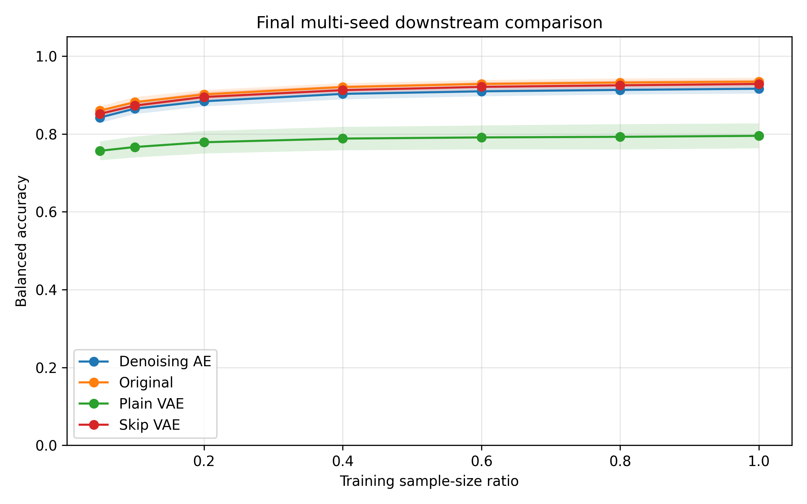

# Results Interpretation

This document summarizes the final multi-seed reconstruction experiment for downstream X-ray classification under sample scarcity.

## Dataset

The final experiment used 5,228 X-ray images across three classes:

```text
COVID, NORMAL, PNEUMONIA
```

For each random seed, the dataset was split into training, validation, and test sets:

| Split | Number of images |
|---|---:|
| Train | 3,659 |
| Validation | 523 |
| Test | 1,046 |
| Total | 5,228 |

The split sizes were identical across seeds because the dataset size and split proportions were fixed. The seed changes which specific images are assigned to each split, as well as model initialization, classifier randomness, and bootstrap sampling.

## Compared Methods

The final experiment compared four input pipelines:

| Method | Description |
|---|---|
| Original | Classifier trained directly on original X-ray images |
| Skip VAE | Classifier trained on images reconstructed with a skip-connected VAE |
| Plain VAE | Classifier trained on images reconstructed with a plain VAE without skip connections |
| Denoising AE | Classifier trained on images reconstructed with a denoising autoencoder |

The downstream classifier was kept fixed across methods so that the comparison focused on the reconstruction strategy rather than classifier architecture.

## Experimental Setting

The final experiment used five random seeds:

```text
42, 123, 777, 2024, 2025
```

The downstream classifier was evaluated under sample scarcity using the following training sample-size ratios:

```text
0.05, 0.10, 0.20, 0.40, 0.60, 0.80, 1.00
```

The primary downstream metric was balanced accuracy.

Balanced accuracy was used because the dataset contains multiple classes and may be class-imbalanced.

## Sample-Size Regime

A central goal of this experiment was to evaluate how downstream classification performance changes as the number of labeled training images increases.

For each seed, the full training split contained 3,659 images. The classifier was evaluated using progressively larger fractions of this training split.

| Sample-size ratio | Approximate number of training images used |
|---:|---:|
| 0.05 | 183 |
| 0.10 | 366 |
| 0.20 | 732 |
| 0.40 | 1,464 |
| 0.60 | 2,195 |
| 0.80 | 2,927 |
| 1.00 | 3,659 |

The test set remained fixed at 1,046 images for each seed.

This design allows the experiment to measure not only final classifier performance, but also how quickly each method improves as more labeled training data become available.

In other words, the experiment evaluates sample efficiency: whether a method performs better in low-data regimes and whether it maintains performance as the available training set grows.

## Sample-Efficiency Perspective

Because this project focuses on sample scarcity, the main question is not only which method achieves the highest final score, but also how much labeled training data is needed to reach near-final performance.

The learning curves suggest that balanced accuracy increases with training sample size and begins to plateau at higher sample-size ratios. This means that using a reduced fraction of the training set may achieve performance close to the full-data setting.

This should be interpreted as a sample-efficiency question rather than only a superiority question.

A reconstruction method does not need to significantly outperform the original-image baseline to be scientifically interesting. It may still be useful if it preserves performance in low-data regimes or reaches near-full-data performance with fewer labeled examples.

Future analysis should therefore quantify:

- the performance gap between 60% and 100% training data
- the minimum sample-size ratio needed to reach 95% of full-data performance
- whether reduced-data performance is practically equivalent to full-data performance
- whether reconstruction methods help more strongly in the lowest-data regimes

## Final Multi-Seed Learning Curve

The final multi-seed comparison is shown below.



The curve shows mean balanced accuracy across five seeds. The shaded regions represent uncertainty across seeds.

## Sample-Efficiency AUC

Sample-efficiency AUC summarizes the downstream learning curve across all sample-size ratios. Higher AUC indicates better overall performance across low-data and higher-data regimes.

| Method | Mean AUC | Standard deviation | 95% CI | Seeds |
|---|---:|---:|---:|---:|
| Original | 0.8725 | 0.0079 | 0.8627–0.8822 | 5 |
| Skip VAE | 0.8655 | 0.0087 | 0.8547–0.8763 | 5 |
| Denoising AE | 0.8552 | 0.0098 | 0.8430–0.8674 | 5 |
| Plain VAE | 0.7470 | 0.0231 | 0.7183–0.7758 | 5 |

## Main Result

Across five random seeds, reconstruction-based inputs did not outperform the original-image baseline.

The original-image baseline had the highest mean sample-efficiency AUC:

```text
Original AUC = 0.8725
```

Skip VAE was close to the original baseline:

```text
Skip VAE AUC = 0.8655
```

Denoising AE was also relatively close, but slightly lower:

```text
Denoising AE AUC = 0.8552
```

Plain VAE performed substantially worse:

```text
Plain VAE AUC = 0.7470
```

Across all methods, balanced accuracy increased as the training sample-size ratio increased. This confirms the expected effect of sample size on downstream classification: using more labeled training images generally improved performance.

However, the relative ranking of the methods remained stable across most sample-size ratios. Original and Skip VAE were near the top, Denoising AE was slightly lower, and Plain VAE was clearly below the other methods.

## Interpretation

The results suggest that reconstruction does not automatically improve downstream classification under sample scarcity.

Skip-connected VAE and denoising autoencoder reconstructions preserved downstream classification performance relatively well, but they did not clearly improve over the original-image baseline.

The plain VAE showed a consistent and substantial reduction in balanced accuracy. This suggests that the plain VAE bottleneck may remove or distort task-relevant image information needed by the downstream classifier.

The sample-size trend is also important. All methods improved as more labeled training images became available, but reconstruction did not change the overall sample-scarcity pattern enough to outperform the original images. This means the reconstruction methods did not provide a clear sample-efficiency advantage in this experiment.

## Important Caution

The confidence intervals for Original, Skip VAE, and Denoising AE overlap. Therefore, these results should not be interpreted as strong evidence that one of these three methods is statistically superior.

However, the Plain VAE result is clearly lower than the other methods, suggesting that latent compression without skip connections is less effective for preserving downstream classification information in this experiment.

## Main Takeaway

The main takeaway is:

> Reconstruction architecture matters. In this experiment, skip-connected VAE and denoising autoencoder reconstructions preserved downstream classification performance much better than a plain VAE, but reconstruction-based inputs did not outperform the original-image baseline.

A second important takeaway is:

> Increasing the number of labeled training images improved balanced accuracy across all methods, confirming that sample size strongly affects downstream classification performance.

## Practical Implication

For this dataset and experimental setup, using original images remains the strongest baseline.

If reconstruction is used as a preprocessing step, architectures that preserve image detail, such as skip-connected VAEs or denoising autoencoders, appear more reliable than plain VAE reconstruction.

However, reconstruction should not be assumed to improve performance in low-data regimes. Its downstream utility should be evaluated directly across sample-size ratios.

## Limitations

These results should be interpreted with the following limitations:

- The experiment uses one X-ray dataset.
- Images are resized to `64 x 64`, which may remove fine visual details.
- The main downstream classifier is fixed, so results may differ with CNN-based classifiers.
- The reconstruction models were trained with a limited configuration.
- The experiment evaluates downstream classification performance, not clinical validity.
- No clinical conclusions should be drawn from these results.

## Conclusion

Across five random seeds, the original-image baseline achieved the strongest overall downstream performance. Skip VAE and denoising AE reconstructions remained close to the original baseline, while plain VAE reconstruction substantially degraded performance.

The sample-size analysis showed that balanced accuracy improved as more labeled training images were used, confirming the importance of training-set size for downstream classification.

These results support a cautious conclusion: reconstruction can preserve downstream information when the architecture retains sufficient image detail, but reconstruction alone does not guarantee improved classification or better sample efficiency under sample scarcity.